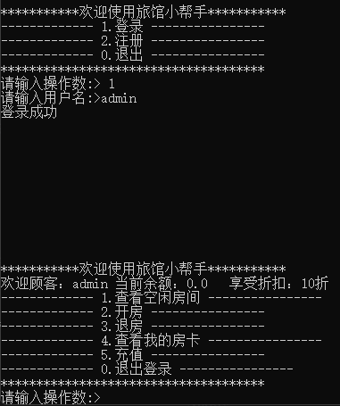

# 2023-backend-recruit-01

## 目录
- [2023-backend-recruit-01](#2023-backend-recruit-01)
  - [今年后端考核相比于往年的主要不同](#今年后端考核相比于往年的主要不同)
  - [选择的思路](#选择的思路)
  - [各个方向的介绍](#各个方向的介绍)
    - [Java](#java)
      - [简要介绍](#简要介绍)
      - [学习路线](#学习路线)
    - [C/C++](#cc)
      - [简要介绍](#简要介绍-1)
      - [学习路线](#学习路线-1)
    - [GoLang](#golang)
      - [简要介绍](#简要介绍-2)
      - [学习路线](#学习路线-2)
  - [考核形式](#考核形式)
    - [第一轮考核](#第一轮考核)
      - [旅店管理系统具体要求](#旅店管理系统具体要求)
      - [界面示例](#界面示例)
      - [其他要求](#其他要求)
      - [各个语言可能涉及到的关键特性](#各个语言可能涉及到的关键特性)
      - [提交内容](#提交内容)
      - [其他](#其他)
    - [后续考核形式](#后续考核形式)
      - [考核形式一](#考核形式一)
      - [考核形式二](#考核形式二)
  - [23爪哇后端考核时间线](#23爪哇后端考核时间线)
  - [联系我们](#联系我们)
  - [其他](#其他-1)

## 今年后端考核相比于往年的主要不同

* 丰富考核方向：相比于往年的后端考核，今年的考核向你们介绍了后端的其他方向。比如往年后端考核主要以 Java 后端开发的方向为主。今年的考核我们**引导，鼓励你们尝试后端的其他技术栈方向，比如C/C++，go或是其他等**。所以今年的考核会向你们介绍主要的三个技术栈方向 Java，C/C++，go，包括这三个方向的学习资料，发展路径等相关内容。
* 革新考核形式：为了吸引更多优秀的同学进入部落，我们提供了自由度更高的考核方式，详见[考核形式二](https://github.com/gduf-cs-tribe/2023-backend-recruit-01#%E8%80%83%E6%A0%B8%E5%BD%A2%E5%BC%8F%E4%BA%8C)。

## 选择的思路

 - 最重要的是选择自己喜欢的方向！
 - 可以从下方不同的方向的发展路径，就业行情去考虑。
 - 不同的方向有不同的特点，学习曲线也不一样，选择自己喜欢的。
 - 第一轮考核是语言基础入门，比较简单，也可以在先做完一个方向的考核的情况下去尝试另一个方向，拓展自己的广度，等到第二轮的时候再来做选择，这个时候你可能已经开始有自己的一些见解了，更能帮你做出判断
   - 在做出这些判断，选择的时候最好是联系文档下方的师兄师姐沟通沟通
 - 从后面第二轮开始后，也不是说选了某个技术栈方向后就一定是走这个技术栈方向了。后期(大三大四或是考研工作之后)从一个技术栈转到另一个技术栈也不是说不可以，部落也有这样的案例。后端在还没有进入到细分领域之前，很多东西都是相通的，进入细分领域之后也相通，只不过相关度没那么高了。
 - 还有一点需要提醒的是，学校的教学语言是C，C带入门之后，主 Java 技术栈
 - 还有就是不同方向的薪资问题，可以这么说，不管哪个方向，只要能冲到头部，薪资都是不低的。而不同的是，不同方向能冲到头部的比例，以及不同方向发育空间。总的来说，
    - Java方向比较依靠业务，业务上升则个人也跟随上升，不过不是所有公司都有那么大的那么复杂的业务
    - 而 C/C++，Go 的云原生方向比较依靠技术，公司有相关技术探索需求，就会带动个人技术提升。

* 关于考研的话，选择的方向可以尽量的偏向计算机底层或者基础架构的方向。

## 各个方向的介绍

### Java

#### 简要介绍

* Java能做什么
  * Java 语言主要走的是 **web后端开发** 这条路，最典型的就是做网页后台开发，就是对接数据库，将数据库内对应的数据进行组合交于前端渲染。这也就是为什么每个人进入一个网页有自己的个人信息，可以操作属于自己的信息等等。

* Java学习难度
  * **入门快，语法糖多**，比起C语言，那简直是干净的不得了。
  * B站搜索Java基础哪个视频播放量高，就选择哪个，发现这个老师不适合自己，那我就选另外播放量高的，就这样。

* Java的现状
  * Java 在国内的**生态比较好**。
  * 目前来看 Java 的岗位依然很多，但走 Java 这条路的人成倍的增长，所以现在 Java 岗位依旧是处于 “狼多肉少” 的局面。
* Java这条路如何
  * 部落走这个方向的人比较多，后期你能了解到的案例会比较多，过去十年多的师兄师姐的经历，走出来的路，我想是比较稳的，只是最近今年变革比较大，需要更加卷，更早的出去实习。

#### 学习路线

- JavaSE：大致过一遍，需要掌握基本API的使用、面向对象语言的特点，建议视频入门，没必要买那种又厚又重的书
- JavaWeb：需要掌握Java网络编程基础Servlet、Socket、HTTP、JDBC、MySQL
- SSM：入门框架，需要掌握Spring、Spring MVC 、Mybatis或其他流行ORM框架
- SpringBoot：熟练使用注解开发、Maven工程管理
- 进入分布式大门：掌握微服务治理理念、各类中间件学习。
  - 数据库：Redis、MongoDB、PostgreSQL、Mysql
  - 消息队列：RabbitMq、RocketMq、Kafka
  - 各家SpringCloud：注册中心、网关、分布式事务、分布式锁、日志监控
  - 搜索：Elastic Search
  - 部署：Docker、k8s、Linux
  - .......
- 回头看（重点学习！提高计算机素养的重要阶段）：
  - JavaSE和相关源码：集合、并发、IO.....
  - Mysql、Redis原理：对理解数据库工作原理很有帮助，感兴趣可写内核
  - SpringIOC原理：解构Spring，不用再害怕相关面试八股
  - JVM：相关GC算法、实现原理、收集器区别。
- 项目
  - Github必须会用
  - 业务项目
    - 商城、外卖
  - 轮子项目
    - RPC、线程池、MQ、IOC、MVC

### C/C++

#### 简要介绍

* 学习曲线比较平缓，是比较**接近计算机底层**的语言，相比于Java，入门时就需要接触理解计算机底层相关概念，学习过程不会那么立竿见影。
* 就业岗位相对较少，但是就业面很广，很多底层相关的方向都需要用 C 语言来写，只是量都不大。可以就业的方向包括但不限于安全，**linux内核，网络，虚拟化，存储，协议，驱动，客户端，游戏**等等。C/C++ 一般在这些方向做研发性工作，需求量相比开发要少不少，所以岗位容量也相对较少。
* C/C++ 参与这些方向多数比较看重技术，比较吃经验。因为这些方向离底层比较近，而计算机底层硬件，OS等变动都很慢，所以经验的时效性相对较长。但也是因为较底层，所以能接触到应用层的业务比少。

#### 学习路线

 - 语言入门，计算机相关基础的入门，建议视频入门，没必要买那种又厚又重的书
 - 虚拟机使用，Linux使用入门，vim，gcc，make，cmake，gdb等工具入门
 - 入门级练手项目：开始尝试写写五子棋，推箱子，贪吃蛇等
 - 一些周边工具使用入门，git，github，docker，rpm/deb，以及linux常见的运维工具，磁盘，网络等常见的工具
 - 操作系统基础原理入门，计算机网络，数据结构以及一些常见的算法等入门
   - 虽然这里只出现几个名称，但是每一个都够喝一壶
   - 但是入门阶段不建议这里的每遇到一个就去深挖，广度还不够，意义有限
 - 结合操作系统，计算机网络，数据结构，算法等提升项目的复杂度，比如比较经典的网络库项目，或者线程池，内存池项目等
 - 补充应用层相关知识，Web开发，关系型数据库，键值数据库，消息队列，搜索引擎等
   - 还不需要在这个阶段深挖这些东西，知道怎么使用就行
 - 关注性能，关注底层实现，使劲优化项目的某个点来挖掘知识深度
 - 继续探索底层基础
   - 最好返回去软件的第0层，从汇编重新学起，有很多东西可以刷新原先错误的理解
   - 同时有了汇编的基础之后，最好能重新认识一些操作系统，去跟操作系统的实践课
 - 有了底层基础之后，可以考虑选择一个细分方向继续深挖
   - 方向包括但不限于安全，linux内核，虚拟化，网络，虚拟化，存储，协议，驱动，分布式
   - 部落之前走这些方向的人比较少，因为大部分学校也都是主Java方向的。较近的几届开始有师兄师姐走这个方向，有在尝试存储方向的师兄，也有在做内核/虚拟化的师兄。这些方向路不好走，同时还需要一定的机会和运气，所以这些方向能给你们提供的案例比较少。如果想走这个方向有比较大的挑战和未知性。但是反观一下，有哪个方向不是充满未知的。所以希望你们以后也能勇于挑战，给后面的师弟师妹带来更多的案例。

### GoLang

#### 简要介绍

* 几年前开始火起来的语言，**各种框架和库都比较新**，就业没有要求必须熟练某某框架。
* 可以和 Java 一样做常见的Web后端，同时有自己的特色领域云原生，大多数云原生框架，中间件是用go写的
* 部落有从 Java 转 Go 的师兄，从事后端开发的方向。做云原生的比较少。
* 比较少有人直接拿Go来当做自己的第一个技术栈，一个是因为这门语言还比较新，大部分人是转过去的，同时也因为他比较新没什么自己的技术栈。如果要说有，那就是云原生了，但是云原生不是用来入门计算机的。
* 如果后期有转Go的想法，一定要尽量往云原生上去靠，多多接触 Docker，k8s，etcd 等等这种业界有名的项目。

#### 学习路线

- 虽然想学的是Go，但是最好还是先入门C，然后在来看Go的内容
- GoLang基础语法入门，可以先忽略一些暂时用不上语法新特性。建议视频入门，没必要买那种又厚又重的书。建议视频入门，没必要买那种又厚又重的书网络上的视频教程完全够用。可以直接b站搜索，哪些播放量高就点那些。
- 其他基础阶段的入门可以参考C/C++路线
  - 甚至可以先按着C/C++的方向先学着，等到差不多快到选择细分方向的时候，如果对这个方向感兴趣，可以考虑研究云原生领域相关内容
- 在知道了操作系统，计算机网络，数据结构，算法，Web开发，关系型数据库，键值数据库，消息队列，搜索引擎之后，如果想往云原生方向靠的话，就可以开始考虑关注业界一些知名的云原生框架，中间件了
- 市场上直接奔云原生这个方向的人很少，竞争压力当然会比Java小很多，但是和C/C++类似，岗位需求量目前也不是很多
- 想涉足这种有活跃的开源社区的领域，最好的方法就是参与开源活动，给社区提issue，提pr，打patch
- 由于近几届没有直接走这个方向的师兄师姐，关于这个方向能给你们提供的参考建议比较有限，但还是鼓励你们能勇于尝试，不确定性在哪个方向都是有的，总是需要有人迈开第一脚。

## 考核形式

### 第一轮考核

- 无论师弟师妹们选择哪个方向，第一件要做的事情就是熟悉语言基础。因此，第一轮考核的要求是**使用自己选择的语言完成一个 “旅店管理系统”**。

#### 旅店管理系统具体要求

1. 实现用户的增删改查，用户**角色**分为管理员和顾客。
   1. 管理员账号可以预设。
   2. 顾客可以细分为会员账号和普通账号。
2. 酒店**房间**的增删改查
   1. 只有管理员账号才能对酒店房间进行删除和增加。
   2. 顾客可以订房间，注意扣减相应余额和修改对应房间的状态。
   3. 顾客可以查询房间的类型、价格、剩余数量等。
3. 实现数据的**持久化**，也即程序关闭之后，用户、房间等的信息不会消失，而是被保存到磁盘中，下次运行程序时可以被重新加载。
4. 可以自行发挥，添加其他功能，但需要保证业务逻辑正确。
5. 不要求好看的前端界面，可以使用命令行窗口代替，如下：

#### 界面示例

#### 其他要求

1. 使用 git 作为本次项目的版本控制工具，并将**源代码**放到 github 上面托管，请不要将IDE交上来。
   1. 什么是 git ? 请参考下列相关资料，加上自行谷歌。
      1. [Git的介绍以及基本使用 - 掘金](https://juejin.cn/post/7246313318544834615?searchId=2023102323355872C532323C258A9E0350)
      2. [Git到底是什么?](https://www.bilibili.com/read/cv15412717/)
   2. 什么是 github ？
      1. [Github 是什么，有什么用？](https://github-zh.com/post/what-is-github)
   3. 其他资料
      1. 官方文档 ： [Git - Book](https://git-scm.com/book/zh/v2/)
      2. 使用心得：[git使用心得](https://wumingsheng.gitbooks.io/-git/content/)
2. 使用  **MarkDown 语法** 书写考核（包括接下来所有考核）所需要的所有文档。并提交 .md 格式的文档
   1. 什么是 MarkDown ?  [什么是 MarkDown](https://www.zhihu.com/question/19963642)
   2. 推荐的 MarkDown 语法编辑器：Typora

#### 各个语言可能涉及到的关键特性

- Java: 类，函数，封装，接口，继承，多态，异常处理，修饰符，集合框架，IO流
- C: 函数，指针，结构体
- C++: 函数，指针，结构体，继承，多态，模板，STL
- GoLang: 函数、指针、结构体、切片、继承、接口

#### 提交内容

1. github/gitee 仓库地址，仓库内容包括：
   1. 源代码 （Talk is cheap, show me the code）
   2. README.md 文件：使用 **MarkDown** 语法书写的项目介绍文档，内容包括:
      1. 项目介绍
      2. 项目使用的语言，用到了该语言的什么语法、特性等
      3. 完成的功能
   3. 注意： 
      1. README.md 中的图片一定要确保可以被访问到，不要出现图片路径是本地路径这种低级错误。建议在仓库中开一个`image`文件夹来放置所有图片。
      2. 请确保你的仓库被设置为 **public**, 以便我们访问你的仓库。（gitee 的仓库默认为 private，记得修改）
2. 请在第一轮考核截止日期之前，将仓库地址通过邮箱的方式发送给我们。
   1. 邮箱地址：306031875@qq.com
   2. 邮箱主题：23爪哇后端第一次考核_专业_姓名，例如：23爪哇后端第一次考核_软工_小刚。（请严格按照该方式命名）
   3. 邮箱内容：你的仓库地址，例如：https://github.com/XXX/XXX

#### 其他

- 无论选择什么语言，让别人看懂你的代码都非常重要，因此
  - 按照一定的规范书写你的代码，例如正确的变量命名，方法命名等。
  - 在关键的代码写上注释。
- 代码规范参考：
  - Java：[《阿里巴巴 Java 开发手册》](https://ucc-private-download.oss-cn-beijing.aliyuncs.com/ff52070cd4bd419e9b775b47039b0ef8.pdf?Expires=1698510192&OSSAccessKeyId=LTAIvsP3ECkg4Nm9&Signature=DteSjSue%2FJzvhDXrq%2BzfSB3j0J0%3D)
  - C: [《OpenHarmony C语言编程规范》](https://gitee.com/openharmony/docs/blob/master/zh-cn/contribute/OpenHarmony-c-coding-style-guide.md)
  - C++: [《Google C++ 风格指南》](https://zh-google-styleguide.readthedocs.io/en/latest/google-cpp-styleguide/contents/)
  - Golang: [《Go 语言编码规范》](https://learnku.com/go/wikis/38426)
- 如果你已经熟悉了一门语言的基本语法，并且产出过类似的项目，觉得这份考核过于简单。或者你想要走的方向，使用的语言不在上述提到的语言中。可以及时跟我们联系，我们会进行特殊处理。

### 后续考核形式

> 本次后端组招新拟定为 **“三轮考核+一轮面试”** 。但后续可能根据考核提交的质量和数量等因素动态调整轮数。

#### 考核形式一

考核形式一针对现阶段没有明确方向，对计算机领域尚不了解的同学。

- 这部分同学，无论你选择上述哪个方向，我们会在每一轮考核开始之前给出相对应的考核任务（类似上面提到的第一轮考核）。
- 如果你对自己的方向不清晰，只要踏踏实实地完成我们的考核，相信你可以踏入进计算机领域的大门。并且完全有机会加入我们！
- 后续考核内容将在相应的时间点公布。

#### 考核形式二

如果你已经确定了你的方向，并且明确了你的学习目标，我们不会限制你完成每个阶段的考核，只需要在规定时间内有符合我们要求的产出，就可以通过考核。具体操作方式如下：

1. **写一份详细的说明文档，内容包括：**
   1. 你要走的细分方向的介绍，包含这个方向是做什么的，对应的职位有哪些，发展情况怎样。
   2. 你的学习路径，包含你在考核期间将要学习的内容以及有哪些阶段性的产出（项目）。
   3. 阶段性产出的呈现方式，例如：源码+说明文档，阶段性成果汇报等。
2. **将说明文档发送给我们，我们会评估其可行性。**
3. **如果可行，你只需要在你自己规划的时间段内给到我们相应的产出，就有机会通过考核。**
4. 注意：
   1. 阶段性产出正常情况下与每轮考核的结束时间相同，也就是说你需要在每一轮的截止时间之前给到我们这个阶段你的产出。（具体时间参考 -> [**23爪哇后端考核时间线**](https://github.com/gduf-cs-tribe/2023-backend-recruit-01#23%E7%88%AA%E5%93%87%E5%90%8E%E7%AB%AF%E8%80%83%E6%A0%B8%E6%97%B6%E9%97%B4%E7%BA%BF)）
   2. 如果有特殊情况，例如，每轮考核的时间过短不足以让你有可以提交的产出，需要调整提交时间，请在说明文档里面写清楚理由和你自己拟定的安排。
   3. 说明文档必须详细，要体现出你的该方向的了解，让我们相信你有明确的学习计划并且能够产出足够含金量的项目。
   4. 说明文档使用 MarkDown 语法书写，作为 github/gitee 仓库的 README.md 文件。
5. 提交方式：将仓库地址（仓库内包含你的说明文档）通过邮箱的方式发送给我们。
   1. 邮箱地址：warrior22@qq.com
   2. 邮箱主题：**23爪哇后端自定义考核说明\_专业\_姓名**，例如：23爪哇后端自定义考核说明\_软工\_小刚。（请严格按照该方式命名）
   3. 邮箱内容：你的仓库地址，例如：https://github.com/XXX/XXX
6. 说明文档提交截止时间：**2023 年11月11日**

## 23爪哇后端考核时间线

1. 第一轮考核：2023.10.27~2023.12.02
2. 第二轮考核：2023.12.末~2024.02.初
3. 第三轮考核：2024.02.末~2024.04.初
4. 面试：2024.05.初

> 此时间线为暂定，后续可能会发生调整

## 联系我们

* 师兄邮箱：
  * 306031875@qq.com
* 咨询群：

* 注意：**请问一些有营养，值得回答的问题，有些问题可能不会收到回复**。问问题的方式参考：[《提问的智慧》](https://github.com/ryanhanwu/How-To-Ask-Questions-The-Smart-Way)

## 其他

 1. 什么样的人能进部落：
    1. 我们将综合考量你们的几次考核成绩，面试表现以及个人综合素质进行考量，择优选择；
 2. 部落能提供什么：
    1. 部落里的师兄师姐会作为过来人提供一些学习路线，未来职业规划
    2. 部落有属于自己的工作室（本部和清远都有），可以作为学习的地方
    3. 像一些大型的比赛，比如 ACM，学校的名额都是直接给到部落
    4. 一群志同道合的朋友
    5.  ……
 3. 你能收获什么？
    1. 本次23届的招新对小白或者是有基础的都有针对性的考核方案，所以在这持续几个月的学习中，你可以收获从无到有/从了解到深入理解……
    2. 无论是最后有没有进入部落，对你们而言都是利 > 弊，可以收获能力，毅力……
